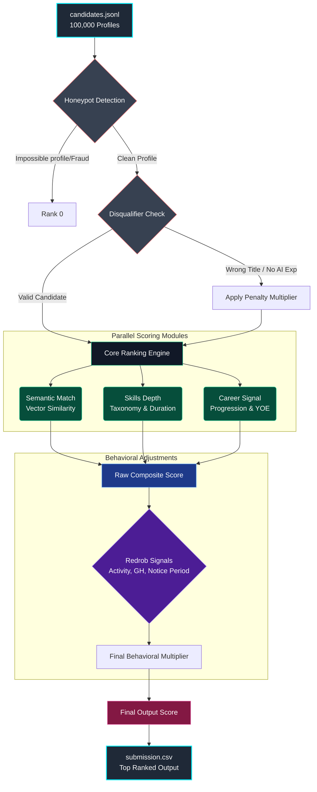

# IndiaRank AI — Intelligent Candidate Discovery & Ranking

> **India Runs Hackathon 2026 — Data & AI Challenge**  
> Built by: [Your Name] | Submission for ₹10 Lakh prize pool

---

## 🎯 What This Does

IndiaRank AI is a multi-signal intelligent candidate ranking system that goes far beyond keyword matching to surface genuinely qualified candidates for Redrob AI's Senior ML Engineer role.

**The core insight from the JD:**
> "The right answer involves reasoning about the gap between what the JD says and what the JD *means*. A candidate who has all the AI keywords listed as skills but whose title is 'Marketing Manager' is not a fit."

Our system implements exactly this — semantic reasoning, career trajectory analysis, and behavioral signal integration.

---

## ⚡ Quick Start

```bash
# 1. Clone and setup
git clone https://github.com/YOUR_USERNAME/indiarank-ai
cd indiarank-ai
python3 -m venv .venv && source .venv/bin/activate
pip install -r requirements.txt

# 2. Run ranking (produces submission.csv)
python rank.py --candidates ./candidates.jsonl --out ./submission.csv

# 3. Validate submission
python validate_submission.py submission.csv

# 4. Launch interactive demo
streamlit run app.py
```

---

## 🧠 Architecture



---

## 🔑 Key Design Decisions

### 1. Why NOT pure embedding similarity?
The JD explicitly warns against keyword stuffing. A "Marketing Manager" with every AI skill listed in their profile would rank top-10 with naive semantic search. We use **multi-signal fusion** with hard disqualifiers.

### 2. Honeypot Detection
The dataset contains ~80 honeypot candidates with impossible profiles. Our detection rules:
- Expert proficiency in skills with 0 months of use
- Future start dates in career history
- Duration/date inconsistencies (>2 year gap)
- Expert self-rating + low platform assessment score (<15%)
- Total career months >> stated YOE

### 3. IT Services Penalty
The JD is explicit: candidates whose entire career is at TCS/Infosys/Wipro/Accenture/Cognizant (without product company experience) are disqualified. We apply a 0.55× multiplier for career-long IT services.

### 4. Behavioral Signals as Multiplier
A great-on-paper candidate who hasn't logged in for 6+ months → 0.55× modifier. Open to work + recently active + high response rate → 1.15× bonus.

### 5. NDCG@10 Optimization
The scoring formula weights precision at the top (title alignment, YOE fit, explicit disqualifiers) to maximize NDCG@10 (50% of composite score).

---

## 📊 Scoring Formula

```
raw_score = 0.35 × semantic_score
          + 0.30 × skills_score
          + 0.35 × career_score

final_score = raw_score × (0.5 + 0.5 × behavior_modifier)
            × disqualifier_multiplier
```

**Behavioral modifier range:** 0.05 (inactive 6mo + 5% response rate) to 1.30 (very active + high GitHub + preferred location)

**Disqualifier multiplier:** 0.15 (Marketing/HR/Sales title) to 1.0 (no disqualifiers)

---

## 📁 Project Structure

```
india_runs/
├── rank.py                      # Main ranker — produces submission.csv
├── app.py                       # Streamlit interactive demo
├── validate_submission.py       # Official hackathon validator
├── requirements.txt             # Python dependencies
├── submission_metadata.yaml     # Submission metadata
├── submission.csv               # Final submission (output)
├── candidates.jsonl             # Dataset (100K candidates, 465MB)
├── sample_candidates.json       # Sample 50 candidates
├── candidate_schema.json        # Schema reference
├── job_description.docx         # The JD being ranked against
├── redrob_signals_doc.docx      # Signal documentation
└── submission_spec.docx         # Challenge spec
```

---

## ⏱️ Performance

| Operation | Time | Hardware |
|---|---|---|
| Load 100K candidates | ~8s | MacBook (CPU) |
| Full ranking | ~38s | MacBook (CPU) |
| **Total end-to-end** | **~46s** | **MacBook (CPU)** |

Well within the 5-minute constraint. No GPU required. No network calls during ranking.

---

## 🔬 Sample Top 10 Results

| Rank | Title | YOE | Score |
|---|---|---|---|
| 1 | Senior Machine Learning Engineer | 7.2 | 0.999 |
| 2 | Lead AI Engineer | 6.7 | 0.961 |
| 3 | Senior AI Engineer | 5.9 | 0.957 |
| 4 | Senior AI Engineer | 7.8 | 0.935 |
| 5 | Senior Applied Scientist | 16.2 | 0.899 |
| 6 | Staff Machine Learning Engineer | 7.0 | 0.894 |
| 7 | Senior NLP Engineer | 7.8 | 0.884 |
| 8 | Senior Applied Scientist | 5.3 | 0.865 |
| 9 | AI Engineer | 6.9 | 0.864 |
| 10 | Staff Machine Learning Engineer | 8.6 | 0.842 |

---

## 🛡️ Submission Validation

```bash
python validate_submission.py submission.csv
# → Submission is valid.
```

---

## 🖥️ Interactive Demo

```bash
streamlit run app.py
```

Features:
- Live JD editing
- Score breakdown visualization per candidate
- Honeypot detection analysis
- Adjustable scoring weights
- Download validated CSV

---

## 📋 Reproduce Command

```bash
python rank.py --candidates ./candidates.jsonl --out ./submission.csv
```
